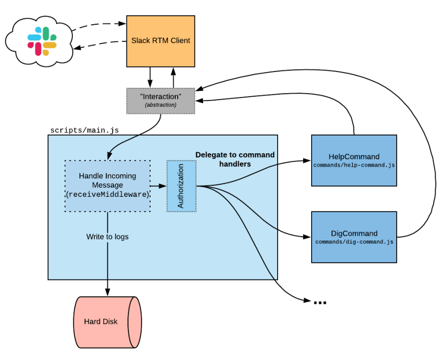

# VinylDNS Bot

VinylDNS Bot is a Slack bot for assisting in providing support via a
Slack channel.

### Running VinylDNS Bot Locally (Non-Docker Example)

You can start VinylDNS Bot locally by running:

    % ./bin/hubot --name vinyldns-bot

You'll see some start up output and a prompt:

    vinyldns-bot>

Then you can interact with vinyldns-bot by typing `vinyldns-bot help`.

    vinyldns-bot> vinyldns-bot help

### Running VinylDNS Bot Locally (Docker & Slack)

1. Setup your
   [Slack-Bot Sandbox](https://github.com/vinyldns/vinyldns-bot/wiki)
   environment
   * _Keep a note of the "Bot User OAuth Access Token", it will be
     needed for Step 3._
2. Get your VinylDNS credentials
   * Click on your username on the top right, click on "Download API
     Credentials"
   * _This information is needed for Step 3_
3. Store Environment Variables

   ```shell script
   $ printf 'HUBOT_SLACK_TOKEN=\nVINYLDNS_API_URI=\nVINYLDNS_API_KEY=\nVINYLDNS_API_SECRET=' > .env
   ```

   * Fill in the `.env` file create in step above. (Docker Compose
     automatically knows to read this file)

   ```shell script
   HUBOT_SLACK_TOKEN=<enter_here> 
   VINYLDNS_API_URI=<enter_here> 
   VINYLDNS_API_KEY=<enter_here> 
   VINYLDNS_API_SECRET=<enter_here>
   ```

4. Create and Start Docker Container

   ```shell script
   $ cd ./docker                   # Make sure you're in the /docker folder
   $ docker-compose up -d
   ```

   * If you are running macOS you may receive the message ` Cannot start
     service vinyldns-bot: Mounts denied: The path /var/log/vinyldns-bot
     is not shared from OS X and is not known to Docker.` In this case,
     you need to override the `BOT_LOG_PATH` environment variable to use
     the `/private` mount point.
   * You can set this in your `.env` file, in your environment, or on
     the command line like so:

     ```shell script
     $ BOT_LOG_PATH="/private/var/log/vinyldns-bot" docker-compose up -d
     ```

### High Level Design



### Organization

##### Top Level

| Directory    | Description                                      |
|:-------------|:-------------------------------------------------|
| `/bin`       | Scripts to run the bot locally, build and verify |
| `/docker`    | Dockerfiles for running and testing              |
| `/resources` | Resources for [README.md](README.md)             |
| `/scripts`   | The root of the bot code                         |
| `/test`      | The root of the bot code unit tests              |

##### Scripts

| Directory    | Description                                                |
|:-------------|:-----------------------------------------------------------|
| `/commands`  | All of the commands that can be executed                   |
| `/config`    | All of the configuration properties                        |
| `/jobs`      | Scheduled jobs.  Like commands, but are run on a schedule. |
| `/lib`       | Supporting library files                                   |
| `/resources` | Resources used by the bot (FAQs, text, etc)                |
| `/main.js`   | The main entrypoint into the bot execution                 |

### Extending

To add a new command, simply create a new `Command` class in the
`/scripts/commands` directory.  
Add this command to the `/script/commands/index.js` and it will be
available to to all users. To restrict access, see the
`/config/authorization-config.js` file.

# Authors

This project would not be possible without the generous contributions of
many people. Thank you! If you have contributed in any way, but do not
see your name here, please open a PR to add yourself (in alphabetical
order by last name)!

## Maintainers 

- Ryan Emerle
- Michael Winslow
